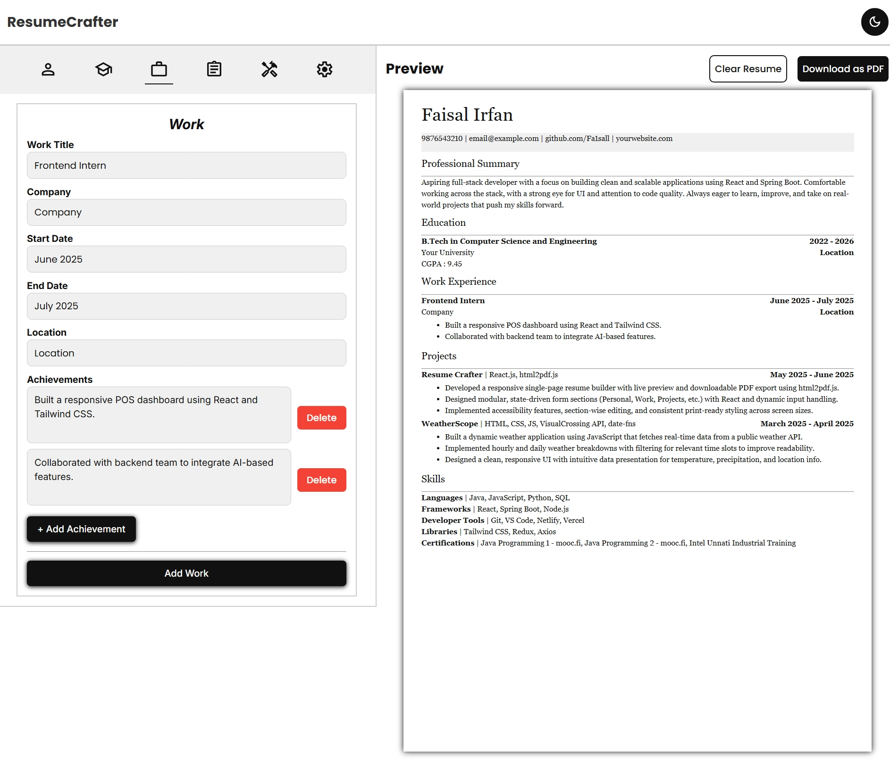
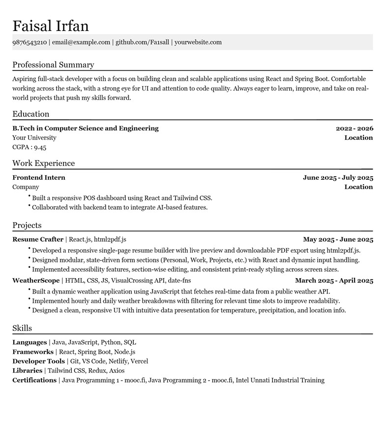

# 📄 ResumeCrafter

**ResumeCrafter** is a modern, single-page resume builder that lets users create, preview, and download professional one-page resumes with dynamic sections and responsive design.

## 📸 Preview

### 🖥️ UI with Live Preview



### 🖨️ PDF Download Output



## ✨ Key Features

- 🧩 Dynamic sections: Personal, Education, Work, Projects, Skills
- 📝 Real-time preview of the resume
- 🎨 Light/Dark mode toggle
- 🖨️ One-click PDF download (html2pdf.js integration)
- 📱 Fully responsive across devices

## 🛠️ Built With

- **React.js** – Component-based UI
- **JavaScript (ES6)** – Logic and state management
- **CSS3** – Clean, responsive design using media queries
- **html2pdf.js** – Print-ready PDF generation
- **Vercel** – Deployment platform

## 🚀 Getting Started

### Installation

```bash
git clone https://github.com/Fa1sall/ResumeCrafter.git
cd ResumeCrafter
npm install
npm run dev
```
